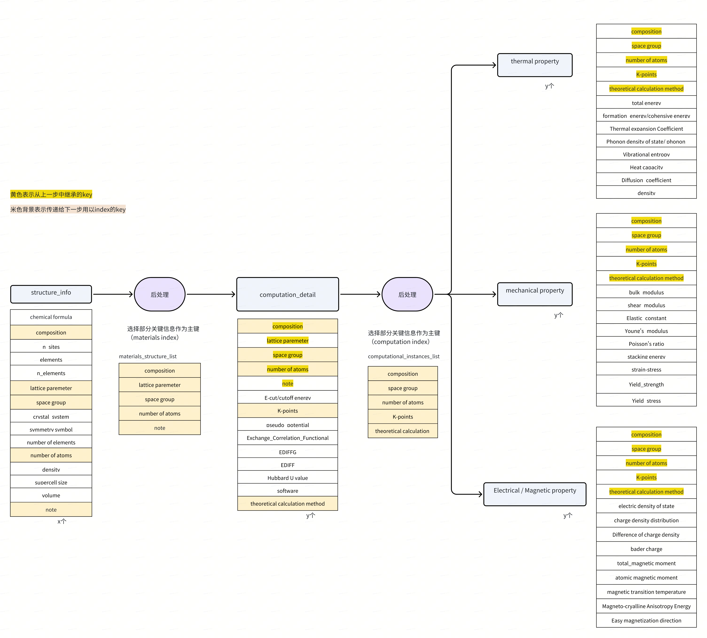

# DataFlow 快速开始指南
<div align="center">
  

[](https://OpenDCAI.github.io/DataFlow-Doc/)
[](https://github.com/OpenDCAI/DataFlow/blob/main/LICENSE)
[](https://github.com/OpenDCAI/DataFlow)
[](https://github.com/OpenDCAI/DataFlow/issues)
[](https://github.com/OpenDCAI/DataFlow/graphs/contributors)
[](https://github.com/OpenDCAI/DataFlow)

<!-- [](https://github.com/OpenDCAI/DataFlow/commits/main/) -->

🎉 如果你认可我们的项目，欢迎在 GitHub 上点个 ⭐ Star，关注项目最新进展。
</div>

## DataFlow-AI4S是什么？

### 核心理念
继承DataFlow数据治理理念，针对AI4S领域解决"数据处理效率提升难、数据处理流程黑盒、算子能力沉淀困难"的三大痛点。现阶段，此repo支持数据处理算子（提取、合成、过滤、评估等）与数据管线的搭建，未来我们将建设从原始文献到高质量数据入库的端到端自动化处理能力。以数据管线为核心驱动，打造从pipeline创建、任务执行跟踪、数据集评估、专家审核、数据入库的闭环流程，敬请期待!!

### 已有功能

1. 多领域文献内容结构化  
   1.1 合金领域结构化提取  
   1.2 合成生物学领域结构化提取  
   1.3 COF 领域结构化提取  
   1.4 通用材料结构化提取模板  

2. 文献曲线识别  
   2.1 曲线图识别  
   2.2 曲线数据点识别  
   2.3 曲线重绘制（矢量图）


## 安装步骤

### 1. 创建并激活 Conda 环境

```bash
conda create -n dataflow python=3.10
conda activate dataflow
```

### 2. 克隆代码仓库 (https://github.com/OpenDCAI/DataFlow)

```bash
git clone git@github.com:OpenDCAI/DataFlow.git
pip install open-dataflow
git clone git@git.dp.tech:dataflow-dp/dataflow-dp.git
```

**注意，`cof_extract_pipeline`、`bio_paper_extract_pipeline`完全是`alloy_extract_pipeline`的简单版本，因此以下着重介绍`alloy_extract_pipeline`**

## 配置步骤

### 4. 设置 GOOGLE vertex API 环境变量

```bash
gcloud auth application-default login
export GOOGLE_APPLICATION_CREDENTIALS="/share/your/vertexai_apikey.json"
export GCP_PROJECT_ID="your_project_ID"
```


### 5. 修改配置文件

在运行示例之前，需要修改 `pipelines/alloy_extract_pipeline.py` 中的配置参数

例如在`alloy_extract_pipeline.py`中，修改
```python
model = ExtractAlloy(entry_file_name="./data/AlloyExtractPipeline/alloy_papers_short.jsonl", mode='MD', max_chunk_len=3200)

```
其中第一个参数`entry_file_name`是输入文件jsonl，每一行需要准备好`doi`, `content`, `figure_components`, 准备的示例代码如下：
```python
with open("alloy_papers.jsonl", "w") as f:
        for root, _, files in os.walk("../Alloy-test"):
            for fname in files:
                if fname.lower().endswith(".json"):
                    paper = os.path.join(root, fname)
                    paper_data = json.load(open(paper, "r"))
                    f.write(json.dumps({"doi":paper_data["token"],
                                        "content": paper_data["content"],
                                        "figure_components": extract_figure_components(paper_data)}) + "\n")
```
这部分代码在主函数的注释当中，也可以直接修改使用。

第二个参数`mode`是选择`json_schema`，因为目前金属提取第二个阶段，也就是提取信息的阶段，有三类信息要提取，`user_prompt`相同，只有输出的json字段不同。

第三个参数`max_chunk_len`是输入token的最大长度。目前测试时调的3200这个值是比较小的，可以适当开大一些，比如16000或32000.

## 运行示例
### 6. 运行示例

```bash
cd dataflow-dp
python pipelines/alloy_extract_pipeline.py
```

目前的输出会在`../alloy_output`的step最大的一个jsonl文件中。其中`materials_name_list`项是所有的金属名称，`alloys_{xx mode}_info`是提取出来的金属信息。

`figure_components`是论文中的图片信息，其中的`figure_class`项是根据caption分类后的图片类别。

## 开发指南
### 7. Pipeline解析
目前的pipeline包括6个算子，`figure_classifier`, `prompt_generator_1`, `parse_alloys`, `get_alloy_names`, `prompt_generator_2`, `parse_alloys_info`.
0. `figure_classifier`是一个简单的分类器，用于对论文中的图片基于caption进行分类。这里不做过多介绍，感兴趣可以看`alloy_extract_pipeline`中的使用。
可以自行定义类别：
```python
self.figure_classify_prompt = AlloyFigureClassifyPrompt()
self.figure_classifier = FigureClassifier(
    llm_serving = self.llm_serving,
    prompt_template = self.figure_classify_prompt,
    classes = ["Alloy Composition", "EDS line scanning analysis", "strain curve", "Bright-field TEM image and SADPs", "Magnetization curve", "Other"]
)
```
1. `prompt_generator_1`会提取`content`中的金属名字，存入`alloys`当中。
2. `parse_alloys`会对`alloys`原地操作，把大模型的字符串输出，转成json object，并提取alloys列表。
例如
```
{\"alloys\": [\"a\",\"b\"]}
```
变成
```json
["a","b"]
```
3. `get_alloy_names`提取alloys中每一项的alloy_name, 并去重，然后得到一个金属名字的列表存到`materials_name_list`当中。
4. `prompt_generator_2`根据`materials_name_list`中的金属，提取`content`中的金属信息，存入`alloys_{self.mode}_info`当中。
5. `parse_alloys_info`会对`alloys_{self.mode}_info`原地操作，把大模型的字符串输出，转成json object，并提取alloys info列表。

### 8. Prompt修改
目前的prompt示例在`alloy.py`当中。其中`AlloyNameExtractPrompt`用于提取名字，`AlloyInfoExtractPrompt`用于提取信息。

每个prompt包含`build_system_prompt`，`build_prompt`和`build_json_schema`。system_prompt可以暂时留空。prompt用于给LLM提供指令，json_schema用于控制LLM输出的格式。

#### 基本Prompt
`AlloyNameExtractPrompt`比较简单，准备好prompt和json_schema就可以，例如
```python
def build_prompt(self, **kwargs) -> str:
    prompt = """You are an expert in high-entropy alloys and materials science.
Your task is to ...
        """
    return prompt

def build_json_schema(self) -> dict:
    json_schema = json.load(open("./schemas/alloy_schemas/basic_schema.json"))
    return json_schema
```
其中json转json_schema可以用https://transform.tools/json-to-json-schema ,**注意生成后要删掉`$schema`这一行**，否则会报错。

在pipeline中，只需要更改
```python
self.prompt_1 = AlloyNameExtractPrompt()
self.prompt_generator_1 = ChunkedPromptedGenerator(
    llm_serving = self.llm_serving, 
    prompt_template=self.prompt_1,
    json_schema=self.prompt_1.build_json_schema(),
    max_chunk_len=max_chunk_len
)
```
里面prompt的名字就可以使用。

而输入（论文具体内容）和输出（金属名字）则是通过
```python
self.prompt_generator_1.run(
            storage = self.storage.step(),
            input_key = "content",
            output_key = "alloys"
        )
```
里面的`input_key`和`output_key`进行控制的。
例如输入（就是最开始的entry_file）
```json
{"content": "foo"}
```
输出
```json
{"content": "foo", "alloys": "bar"}
```
------
`AlloyInfoExtractPrompt`会复杂一些，主要是需要对prompt进行参数传递（这里是`materials_name_list`），以及json_schema的选择。
#### 往Prompt中传参
```python
def build_prompt(self, **kwargs) -> str:
    materials_name_list = kwargs.get("materials_name_list", [])
    prompt = f"""
    You are an expert in high-entropy alloys and materials science.
    Your task is to extract structured materials information from the given scientific text and organize it according to the specified schema.

    ### Instructions:
    Select alloy materials only from the {materials_name_list} provided.
    ...
"""
    
    return prompt
```
可以看到，`materials_name_list`通过kwargs被传入了`build_prompt`当中进行使用。
这个在pipeline中是通过`input_aux_keys`来指定的，如下：
```python
self.prompt_generator_2.run(
            storage = self.storage.step(),
            input_key = "content",
            output_key = f"alloys_{self.mode}_info",
            input_aux_keys = ["materials_name_list"]
        )
```
`input_aux_keys`是一个列表，其中每一项对应输入文件的一个key，这些key对应的项会被全部传入`build_prompt`来使用。

#### json_schema选择
```python
def build_json_schema(self, mode: Literal['experimental','DFT','MD']) -> dict:
    if mode == "experimental":
        json_schema = json.load(open("./schemas/alloy_schemas/experimental_schema.json"))
    elif mode == "DFT":
        json_schema = json.load(open("./schemas/alloy_schemas/DFT.json"))
    elif mode == "MD":
        json_schema = json.load(open("./schemas/alloy_schemas/MD.json"))
    else:
        raise ValueError(f"Unknown mode: {mode}")
            
    return json_schema
```
可以看到，这里分了三种模式。用这种方法可以实现相同的prompt，但是不同的json输出内容。

#### 添加新的prompt
如果需要添加新的prompt，可以参考`alloy.py`中的`AlloyNameExtractPrompt`和`AlloyInfoExtractPrompt`，新建一个类继承自`PromptABC`，实现`build_prompt`和`build_json_schema`方法即可。
之后如果要在`ChunkedPromptedGenerator`中使用，只需要把新建的类传入`prompt_template`参数即可。
注意，还需要修改`ChunkedPromptedGenerator`中可用的prompt类型。
```python
@prompt_restrict(AlloyNameExtractPrompt, AlloyInfoExtractPrompt, CofExtractPrompt)
@OPERATOR_REGISTRY.register()
class ChunkedPromptedGenerator(OperatorABC):
    """
    基于Prompt的生成算子，支持自动chunk输入。
    - 使用tiktoken精确计算token数量；
    - 若输入超过max_chunk_len，采用递归二分法切分；
    - 输出为每行对应的生成结果列表（而非拼接字符串）。
    """

    def __init__(
        self,
        llm_serving: LLMServingABC,
        prompt_template: AlloyNameExtractPrompt | AlloyInfoExtractPrompt | CofExtractPrompt,
        json_schema: dict = None,
        max_chunk_len: int = 128000,
    ):
        self.logger = get_logger()
        self.llm_serving = llm_serving
        self.prompt_template = prompt_template
        self.json_schema = json_schema
        self.max_chunk_len = max_chunk_len
        self.enc = tiktoken.get_encoding("cl100k_base")
```
要修改`@prompt_restrict`中的内容，添加新建的prompt类，并修改`prompt_template`的类型注解。

### 9. Pandas Operator
Pipeline中的`parse_alloys`, `get_alloy_names`, `parse_alloys_info`都是用到`PandasOperator`对dataframe进行操作（是的，dataflow读入文件后storage形态都是pandas dataframe）. `PandasOperator`可以接受一个函数列表。目前代码中为了偷懒，用的都是lambda函数。例如：
```python
# 提取alloys中每一项的alloy_name, 并去重，然后得到一个列表
self.get_alloy_names = PandasOperator(
    [
        lambda df: df.assign(
            materials_name_list=df["alloys"].apply(
                lambda alloys: list(
                    {
                        alloy.get("alloy_name", "").strip()
                        for alloy in alloys
                        if alloy.get("alloy_name", "").strip() != ""
                    }
                )
            )
        ),
    ]
)
```
非常丑陋，**建议用gpt写**，因为我也是用gpt写的哈哈哈哈哈哈

`PandasOperator`详细描述如下：
```python
"该算子支持通过多个自定义函数对 DataFrame 进行任意操作（如添加列、重命名、排序等）。\n\n"
"每个函数（通常为 lambda 表达式）接受一个 DataFrame 并返回一个修改后的 DataFrame。\n\n"
"输入参数：\n"
"- process_fn：一个函数列表，每个函数形式为 lambda df: ...，"
"必须返回一个 DataFrame。\n\n"
"示例：\n"
"  - lambda df: df.assign(score2=df['score'] * 2)\n"
"  - lambda df: df.sort_values('score', ascending=False)"
```

<!-- ## 一个可参考的设计流程(钢研项目为例子)
此部分的代码见 `pipelines\material_extract_pipeline.py`

### 1. 理解需求，整理知识体系
根据你所认知的需求，可以根据该领域的知识体系来设计一套提取流程（概念意义上的）。这套流程应该清楚地表示出应提取的属性，包括但不限于结构、工艺、性质等，下面给出一个示例。


### 2. 流程抽象、Prompt与Schema的设计
根据上图，在数据处理流程中可以抽象出几个层次，每个层次对应一个属性的提取或前/后处理。图中左一模块表示了材料结构中应提取的特征。通过给定良好的prompt（科学约束，见`prompts\evaluation.py`的**class BenchmarkCompareEvaluationPrompt(PromptABC)**）与schema（输出结构约束，见`schemas\material_schemas\computation_detail_schema.json`），大模型将更好地提取期望的输出。
```python
self.prompt_1 = StructureInfoExtractPrompt()
        self.prompt_generator_1 = ChunkedPromptedGenerator(
            llm_serving = self.llm_serving, 
            prompt_template=self.prompt_1,
            json_schema=self.prompt_1.build_json_schema(),
            max_chunk_len=max_chunk_len
        )
```

左二模块则为典型的前/后处理算子，主要功能是提取前一个算子的输出中的关键主键，作为下一次prompt的内容
```python
self.get_material_indexes = PandasOperator([
            lambda df: df.assign(
                material_indexes=df["structure_info"].apply(
                    extract_nested_fields_list_of_dicts,
                    sublist_key="material_structures",
                    keys=["composition", "lattice_parameter", "space_group", "number_of_atoms", "note"]
                )
            )
        ])
``` -->

---

## 一个可参考的设计流程(钢研项目为例子)

本流程的代码实现位于 `pipelines\material_extract_pipeline.py`。该流水线采用多级级联的设计思路，旨在从科技论文中精确提取材料的结构信息、计算细节以及多物理场性质。

### 1. 设计流程与算子映射图

在钢研项目中，设计流程如下图所示，整个过程分为三个主要阶段：**结构提取**、**计算细节提取**与**性质分类提取**。


### 2. 核心设计：科学约束与结构约束

为了保证提取结果的专业性与可解析性，我们采用了“双约束”机制：

#### A. 科学约束 (Scientific Constraints)

**实现位置**：`prompts\materials.py` (继承自 `PromptABC`)
通过在 Prompt 模板中植入领域知识，约束 LLM 的理解逻辑：

* **物理量标准化**：强制模型识别量纲并转换（如能量统一为 ）。
* **逻辑校验**：例如，若提取到某种对称性，Prompt 会要求模型寻找对应的空间群号。
* **上下文锁定**：利用 `input_aux_keys` 将前序步骤的 `material_indexes` 注入当前 Prompt，防止模型在多材料文中产生关联错误。

#### B. 输出结构约束 (Schema Constraints)

**实现位置**：`schemas\material_schemas\*.json`
通过 JSON Schema 严格定义输出格式：

* **字段强类型**：确保 `lattice_parameter` 等数值字段不被提取为描述性文字。
* **枚举值约束 (Enum)**：对计算方法（如 `GGA`, `HSE06`）进行限定，极大降低模型幻觉。

### 3. 流水线阶段详解

#### 第一阶段：结构信息提取与索引构建 (Structure Info & Indexing)

首先从文本中提取基础的材料结构特征。为了保证后续步骤的上下文关联性，我们通过一个后处理算子提取“主键”信息。

* **提取算子 (`prompt_generator_1`)**: 使用 `StructureInfoExtractPrompt` 提取包括化学式、空间群、原子数等结构信息。
* **后处理/索引算子 (`get_material_indexes`)**:
使用 `PandasOperator` 调用 `extract_nested_fields_list_of_dicts` 函数。
* **对应图中**: “选择部分关键信息作为主键 (materials index)”。
* **代码实现**:
```python
self.get_material_indexes = PandasOperator([
    lambda df: df.assign(
        material_indexes=df["structure_info"].apply(
            extract_nested_fields_list_of_dicts,
            sublist_key="material_structures",
            keys=["composition", "lattice_parameter", "space_group", "number_of_atoms", "note"]
        )
    )
])

```


#### 第二阶段：计算细节提取 (Computation Detail)

在已知结构的基础上，进一步提取模拟计算的相关参数（如 K 点、赝势、交换关联泛函等）。

* **提取算子 (`prompt_generator_2`)**: 使用 `ComputationDetailExtractPrompt`。该算子通过 `input_aux_keys = ["material_indexes"]` 接收上一阶段生成的索引，确保 LLM 在提取计算细节时能对号入座。
* **索引算子 (`get_computation_indexes`)**:
提取如 `theoretical_calculation_method` 等字段，作为性质提取阶段的依据。

#### 第三阶段：多分支性质提取 (Property Extraction)

根据计算细节索引，流水线并行或顺序触发三个特定领域的提取分支：

1. **热学性质 (Thermal)**: 对应 `prompt_generator_3` (mode='thermal')。
2. **力学性质 (Mechanical)**: 对应 `prompt_generator_4` (mode='mechanical')。
3. **电学/磁学性质 (Electrical/Magnetic)**: 对应 `prompt_generator_5` (mode='electrical or magnetic')。

> **设计亮点**：图中黄色高亮部分（如 `composition`, `space group`）表示从上一步继承的 Key。通过这种“索引透传”机制，大模型可以精准定位文中描述的具体材料及其对应的物理性质，避免数据错位。

### 3. 算子对应关系表

| 流程阶段 | 逻辑功能 | 代码算子 (Operator / Generator) | 关键 Schema 字段 (Index) |
| --- | --- | --- | --- |
| **Step 1** | 材料结构提取 | `self.prompt_generator_1` | `composition`, `space_group` |
| **Step 2** | 提取材料索引 | `self.get_material_indexes` | 构建 `material_indexes` 列表 |
| **Step 3** | 计算参数提取 | `self.prompt_generator_2` | `K-points`, `theoretical_method` |
| **Step 4** | 提取计算索引 | `self.get_computation_indexes` | 构建 `computation_indexes` 列表 |
| **Step 5** | 性质分类提取 | `prompt_generator_3/4/5` | `Bulk modulus`, `Heat capacity` 等 |

### 4. 如何运行

流水线通过 `forward()` 方法驱动，内部自动维护 `storage.step()` 来管理各算子间的数据流转。

```python
model = ExtractMaterial(entry_file_name="your_data.jsonl")
model.compile()
model.forward(batch_size=100)

```

---

#### **如果你发现你依然没头绪如何使用DataFlow-AI4S，那是由于我的文档写得稀烂所致，请直接在飞书联系本人@黄鉦皓解决遇到的问题。你的每一次提问都会让我更加了解用户（代码使用者）的困惑点在哪。如果你在数据处理中遇到重复造轮子的问题和需求或相关优化建议，也请热情告知！**
